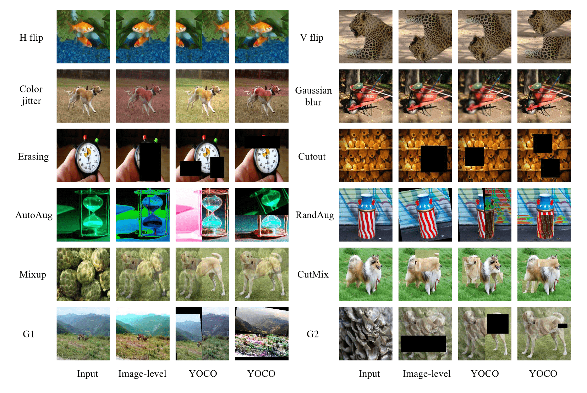

# You Only Cut Once (YOCO)

YOCO is a simple method/strategy of performing augmentations, which enjoys the properties of parameter-free, easy usage, and boosting almost all augmentations for free. We hope our study will attract the community’s attention in revisiting how to perform data augmentations. 

[You Only Cut Once: Boosting Data Augmentation with a Single Cut](https://arxiv.org/pdf/2108.11364.pdf)<br>
[Junlin Han](https://junlinhan.github.io/), Pengfei Fang, Weihao Li, Jie Hong, Ali Armin, [Ian Reid](https://cs.adelaide.edu.au/~ianr/), [Lars Petersson](https://people.csiro.au/P/L/Lars-Petersson), [Hongdong Li](http://users.cecs.anu.edu.au/~hongdong/)<br>
DATA61-CSIRO and Australian National University and University of Adelaide<br>
Preprint

```
@inproceedings{han2022yoco,
  title={You Only Cut Once: Boosting Data Augmentation with a Single Cut},
  author={Junlin Han and Pengfei Fang and Weihao Li and Jie Hong and Mohammad Ali Armin and and Ian Reid and Lars Petersson and Hongdong Li},
  booktitle={arXiv preprint arXiv:2108.11364},
  year={2022}
}
```
YOCO cuts one image into two equal pieces, either in the height or the width dimension. The same data augmentations are performed independently within each piece. Augmented pieces are then concatenated together to form one single augmented image.

　  
   
## Results

Overall, YOCO benefits almost all augmentations in multiple vision tasks (classification, contrastive learning, object detection, instance segmentation, image deraining, image super-resolution). Please see our paper for more. 

## Prerequisites

This repo aims to be minimal modifications on [official PyTorch ImageNet training code](https://github.com/pytorch/examples/tree/master/imagenet) and [MoCo](https://github.com/facebookresearch/moco). Following their instructions to install the environments and prepare the datasets.

[timm](https://github.com/rwightman/pytorch-image-models) is also required for ImageNet classification, simply run

```
pip install timm
```
## Images augmented with YOCO
For each quadruplet, we show the original input image, augmented image from image-level augmentation, and two images from different cut dimensions produced by YOCO.



## Contact
junlin.han@data61.csiro.au or junlinhcv@gmail.com

If you tried YOCO in other tasks/datasets/augmentations, please feel free to let me know the results. They will be collected and presented in this repo, regardless of positive or negative. Many thanks!

## Acknowledgments
Our code is developed based on [official PyTorch ImageNet training code](https://github.com/pytorch/examples/tree/master/imagenet) and [MoCo](https://github.com/facebookresearch/moco). 


